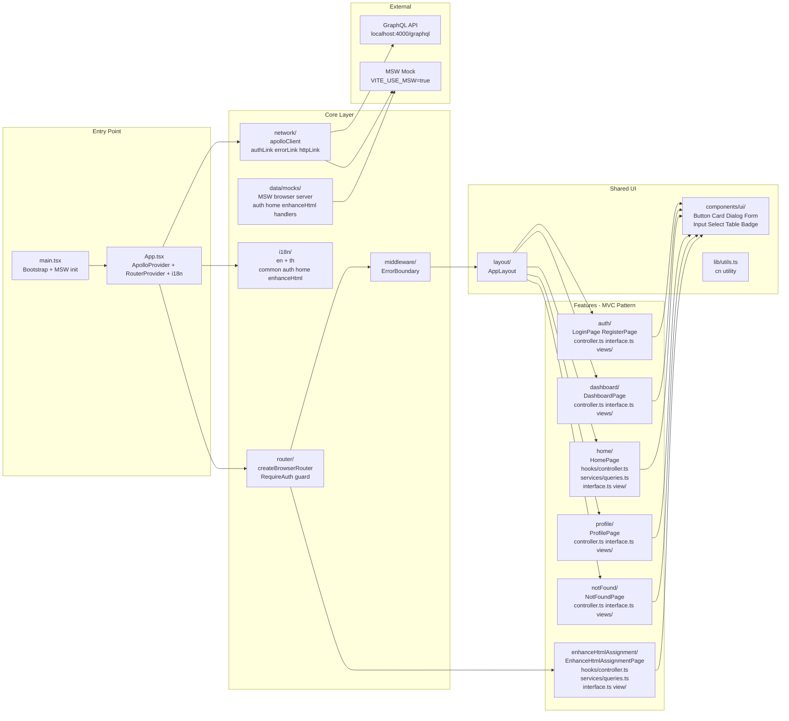

# Project Structure

## Overview

A production-ready **React 18 + TypeScript** single-page application built with a **feature-based MVC architecture**. Each feature owns its own controller (logic), interface (types), page component, and view folder — making the codebase easy to navigate and extend.

---

## Tech Stack

| Category | Technology |
|---|---|
| UI Framework | React 18 + TypeScript 5.9 |
| Build Tool | Vite 7 |
| Routing | React Router v6 (`createBrowserRouter`) |
| API Layer | Apollo Client 4 (GraphQL) |
| Mock Layer | MSW v2 (Mock Service Worker) |
| Styling | Tailwind CSS v3 + Material UI (wrapped) |
| Forms | react-hook-form + Zod |
| i18n | i18next (English + Thai) |
| Testing | Jest + React Testing Library + ts-jest |
| State | Apollo InMemoryCache |

---

## Architecture Diagram



---

## Directory Structure

```
src/
├── main.tsx                  # Bootstrap: MSW toggle + React root
├── App.tsx                   # Root: ApolloProvider + RouterProvider + i18n
├── index.css                 # Global Tailwind CSS
│
├── core/                     # Shared infrastructure (non-feature)
│   ├── network/              # Apollo GraphQL client
│   │   ├── apolloClient.ts   # Client setup: authLink → errorLink → httpLink
│   │   ├── index.ts          # Barrel export
│   │   └── links/
│   │       ├── authLink.ts   # Injects Bearer token from localStorage
│   │       └── errorLink.ts  # Handles 401 → clearToken + redirect /login
│   │
│   ├── router/               # React Router v6
│   │   ├── index.tsx         # createBrowserRouter with all routes
│   │   ├── routes.ts         # ROUTES constant map
│   │   └── guards/
│   │       └── RequireAuth.tsx  # Outlet-based auth guard
│   │
│   ├── i18n/                 # Internationalisation
│   │   ├── index.ts          # i18next init (en + th, auto-detect)
│   │   └── locales/
│   │       ├── en/           # common.json auth.json home.json enhanceHtml.json
│   │       └── th/           # common.json auth.json home.json enhanceHtml.json
│   │
│   ├── theme/
│   │   └── index.ts          # createTheme: reads Tailwind CSS vars → MUI palette
│   │
│   ├── middleware/
│   │   └── ErrorBoundary.tsx # React class error boundary
│   │
│   └── data/
│       └── mocks/            # MSW handlers (browser + Node)
│           ├── browser.ts    # setupWorker for browser
│           ├── server.ts     # setupServer for Jest
│           └── handlers/     # Per-feature mock handlers
│               ├── index.ts              # Combines all handlers
│               ├── auth.ts               # Login / Me mocks
│               ├── home.ts               # GetHomePageData mock
│               └── enhanceHtmlAssignment.ts  # GetProducts / GetServices mocks
│
├── features/                 # Feature modules — each follows MVC pattern
│   ├── auth/
│   │   ├── LoginPage.tsx     # Page entry (route target)
│   │   ├── RegisterPage.tsx  # Page entry (route target)
│   │   ├── controller.ts     # useAuth hook (reads localStorage token)
│   │   ├── interface.ts      # AuthState type
│   │   └── views/            # Sub-components (placeholder)
│   │
│   ├── home/                 # Route: / (inside AppLayout)
│   │   ├── HomePage.tsx      # Page entry — composes Hero + Product + Service
│   │   ├── interface.ts      # Product, Service, HomePageData types
│   │   ├── hooks/
│   │   │   └── controller.ts # useHome() — Apollo useQuery(GET_HOME_PAGE_DATA)
│   │   ├── services/
│   │   │   └── queries.ts    # GET_HOME_PAGE_DATA GraphQL query
│   │   └── view/             # Component subfolders (each has ComponentName.tsx + index.ts)
│   │       ├── HeroSection/
│   │       ├── ProductCard/
│   │       ├── ProductSection/
│   │       ├── ServiceCard/
│   │       └── ServiceSection/
│   │
│   ├── enhanceHtmlAssignment/  # Route: /enhance-html-assignment (standalone — outside AppLayout)
│   │   ├── EnhanceHtmlAssignmentPage.tsx  # Page entry — owns its own Header + Footer
│   │   ├── interface.ts        # Product, Service, EnhanceHtmlAssignmentState types
│   │   ├── hooks/
│   │   │   └── controller.ts   # useEnhanceHtmlAssignment() — two Apollo useQuery calls
│   │   ├── services/
│   │   │   └── queries.ts      # GET_PRODUCTS / GET_SERVICES GraphQL queries
│   │   └── view/               # Component subfolders (each has ComponentName.tsx + index.ts)
│   │       ├── Header/         # Sticky white header with gradient logo + hamburger
│   │       ├── HeroSection/    # Gradient hero with image placeholder
│   │       ├── ProductsSection/ # Responsive horizontal product cards
│   │       ├── ServicesSection/ # Responsive vertical service cards
│   │       └── Footer/         # Dark slate footer with copyright
│   │
│   ├── dashboard/
│   │   ├── DashboardPage.tsx
│   │   ├── controller.ts
│   │   ├── interface.ts
│   │   └── views/
│   │
│   ├── profile/
│   │   ├── ProfilePage.tsx
│   │   ├── controller.ts
│   │   ├── interface.ts
│   │   └── views/
│   │
│   └── notFound/
│       ├── NotFoundPage.tsx
│       ├── controller.ts
│       ├── interface.ts
│       └── views/
│
├── components/               # Shared, feature-agnostic components
│   ├── layout/
│   │   ├── AppLayout.tsx     # Root layout: ErrorBoundary + Outlet
│   │   └── Footer.tsx        # Shared blue footer (used by home feature layout)
│   └── ui/                   # MUI wrappers (never import MUI directly — use @/components/ui)
│       ├── index.ts          # Top-level barrel — import from here or from component subfolder
│       ├── Badge/
│       │   ├── index.ts      # Re-export barrel (enables @/components/ui/Badge)
│       │   └── Badge.tsx     # MUI Chip wrapper (label/pill style)
│       ├── Button/
│       │   ├── index.ts      # Re-export barrel (enables @/components/ui/Button)
│       │   ├── Button.tsx    # MUI Button wrapper (adds loading prop + aria-busy)
│       │   └── Button.test.tsx
│       ├── Card/
│       │   ├── index.ts      # Re-export barrel (enables @/components/ui/Card)
│       │   └── Card.tsx      # MUI Card + CardContent + CardHeader + CardActions
│       ├── Dialog/
│       │   ├── index.ts      # Re-export barrel (enables @/components/ui/Dialog)
│       │   └── Dialog.tsx    # MUI Dialog + sub-components
│       ├── Form/
│       │   ├── index.ts      # Re-export barrel (enables @/components/ui/Form)
│       │   └── Form.tsx      # react-hook-form + MUI FormControl/FormLabel/FormHelperText
│       ├── Input/
│       │   ├── index.ts      # Re-export barrel (enables @/components/ui/Input)
│       │   ├── Input.tsx     # MUI TextField wrapper
│       │   └── Input.test.tsx
│       ├── Label/
│       │   ├── index.ts      # Re-export barrel (enables @/components/ui/Label)
│       │   └── Label.tsx     # MUI FormLabel
│       ├── Select/
│       │   ├── index.ts      # Re-export barrel (enables @/components/ui/Select)
│       │   └── Select.tsx    # MUI Select + MenuItem + FormControl + InputLabel
│       └── Table/
│           ├── index.ts      # Re-export barrel (enables @/components/ui/Table)
│           └── Table.tsx     # MUI Table + sub-components
│
├── lib/
│   └── utils.ts              # cn() — clsx + tailwind-merge
│
└── types/                    # Global shared TypeScript types
```

---

## Layer Descriptions

### Entry Point
| File | Role |
|---|---|
| `main.tsx` | Bootstraps the app. If `VITE_USE_MSW=true`, starts the MSW service worker before rendering. |
| `App.tsx` | Top-level providers: `ApolloProvider` (GraphQL), `RouterProvider` (routing), and i18n import. |

### Core — Network
The Apollo Client uses a **link chain**: `authLink → errorLink → httpLink`.

- **authLink** — Reads `auth_token` from `localStorage` and injects `Authorization: Bearer <token>` on every request.
- **errorLink** — Intercepts GraphQL/network errors. On `401` or `UNAUTHENTICATED`, clears the token and redirects to `/login`.
- **httpLink** — Sends the request to `VITE_GRAPHQL_URL` (defaults to `http://localhost:4000/graphql`).

### Core — Router
React Router v6 `createBrowserRouter`. Most routes are wrapped in `AppLayout` (ErrorBoundary shell).
Protected routes use `<RequireAuth />` — an `Outlet`-based guard that checks `useAuth().isAuthenticated`.
Standalone pages (e.g. `enhanceHtmlAssignment`) are registered **outside** `AppLayout` so they fully own their own layout.

### Core — i18n
Two locales (`en`, `th`), four namespaces: `common`, `auth`, `home`, `enhanceHtml`.
Language is auto-detected from `localStorage`, then browser `navigator`, falling back to `en`.

### Core — Middleware
`ErrorBoundary` wraps routes inside `AppLayout` to catch unhandled render errors.

### Core — Data / Mocks
MSW handlers intercept GraphQL requests during development (`VITE_USE_MSW=true`) and testing (Jest uses `server.ts`). Each feature adds its own handler file under `handlers/` and exports from `handlers/index.ts`.

### Features — MVC Pattern

Newer features (`home`, `enhanceHtmlAssignment`) use the full expanded structure:

| Path | Role |
|---|---|
| `FeaturePage.tsx` | Route-level page component. Composes view/, calls controller. |
| `hooks/controller.ts` | Business logic: custom hooks, Apollo queries, state management. |
| `services/queries.ts` | GraphQL query definitions (`gql` tagged templates). |
| `interface.ts` | TypeScript types and interfaces scoped to this feature. |
| `view/ComponentName/` | Each view component in its own subfolder with barrel `index.ts`. |

Older scaffold features (`auth`, `dashboard`, `profile`, `notFound`) use a flat layout with `controller.ts` at the feature root and an empty `views/` placeholder.

### View Component Subfolder Convention

Each component inside `view/` follows:

```
view/
└── ComponentName/
    ├── ComponentName.tsx       # Component implementation
    ├── ComponentName.test.tsx  # Co-located test
    └── index.ts                # Barrel: export * from "./ComponentName"
```

Import via the folder name (resolves through `index.ts`):
```ts
import { Header } from "@/features/enhanceHtmlAssignment/view/Header"
```

### Shared UI — MUI Wrappers
**Rule:** Never import from `@mui/material` directly. Always import from `@/components/ui`.

Each component folder has:
- `ComponentName.tsx` — the wrapper that exposes MUI's native prop API
- `index.ts` — re-export barrel enabling direct subfolder imports

Two import styles are supported:
```ts
import { Button } from "@/components/ui";          // top-level barrel
import { Button } from "@/components/ui/Button";   // subfolder barrel
```

The MUI theme is driven by Tailwind CSS variables via `src/core/theme/index.ts`, so both systems share one palette.

Badge maps to MUI `Chip` (not MUI `Badge` which is a notification-dot component).

---

## Routes

| Path | Component | Layout | Protected |
|---|---|---|---|
| `/` | `HomePage` | AppLayout | No |
| `/login` | `LoginPage` | AppLayout | No |
| `/register` | `RegisterPage` | AppLayout | No |
| `/enhance-html-assignment` | `EnhanceHtmlAssignmentPage` | Standalone (own Header/Footer) | No |
| `/dashboard` | `DashboardPage` | AppLayout + RequireAuth | Yes |
| `/profile` | `ProfilePage` | AppLayout + RequireAuth | Yes |
| `*` | `NotFoundPage` | AppLayout | No |

---

## Environment Variables

| Variable | Default | Description |
|---|---|---|
| `VITE_USE_MSW` | `false` | Set to `true` to enable MSW mock layer |
| `VITE_GRAPHQL_URL` | `http://localhost:4000/graphql` | GraphQL API endpoint |

---

## Testing

```bash
npm test              # Run all tests
npm run test:watch    # Watch mode
npm run test:coverage # Coverage report (70% threshold)
```

Tests use **Jest + ts-jest + React Testing Library**. MSW's Node `server` is started globally via `jest.setup.ts` to intercept requests in tests.

Test files sit alongside the code they test, inside the component's own subfolder (`ComponentName.test.tsx`).

---

## Key Conventions

- **Path alias:** `@/` maps to `src/` — use it everywhere instead of relative paths.
- **MUI imports:** Never from `@mui/material` directly. Use `@/components/ui` (top-level) or `@/components/ui/Button` (subfolder).
- **Apollo imports:** Use `@apollo/client/react` for `useQuery`, `@apollo/client/testing/react` for `MockedProvider` in tests.
- **Controller = hooks:** Feature business logic lives in `hooks/controller.ts` as custom hooks.
- **Interface = types:** Feature-scoped TypeScript types live in `interface.ts`.
- **View = sub-components:** Each view component lives in `view/ComponentName/` with a barrel `index.ts`.
- **i18n namespace per feature:** `useTranslation("common")`, `useTranslation("auth")`, `useTranslation("home")`, `useTranslation("enhanceHtml")`.
- **Standalone pages:** Pages that own their own full layout (header + footer) are registered outside `AppLayout` in the router.
