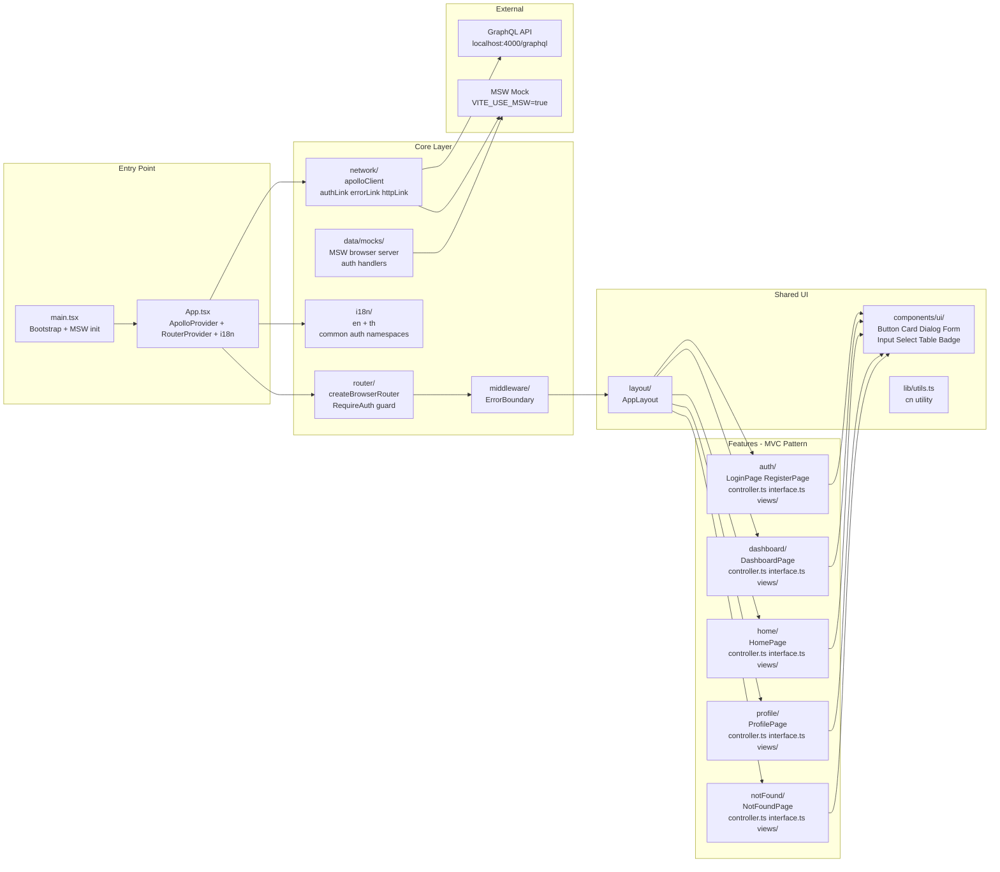

# Project Structure

## Overview

A production-ready **React 19 + TypeScript** single-page application built with a **feature-based MVC architecture**. Each feature owns its own controller (logic), interface (types), page component, and views folder — making the codebase easy to navigate and extend.

---

## Tech Stack

| Category | Technology |
|---|---|
| UI Framework | React 19 + TypeScript 5.9 |
| Build Tool | Vite 7 |
| Routing | React Router v6 (`createBrowserRouter`) |
| API Layer | Apollo Client 4 (GraphQL) |
| Mock Layer | MSW v2 (Mock Service Worker) |
| Styling | Tailwind CSS v3 + shadcn/ui (wrapped) |
| Forms | react-hook-form + Zod |
| i18n | i18next (English + Thai) |
| Testing | Jest + React Testing Library + ts-jest |
| State | Apollo InMemoryCache |

---

## Architecture Diagram



---

## Directory Structure

```
src/
├── main.tsx                  # Bootstrap: MSW toggle + React root
├── App.tsx                   # Root: ApolloProvider + RouterProvider + i18n
├── index.css                 # Global Tailwind CSS
│
├── core/                     # Shared infrastructure (non-feature)
│   ├── network/              # Apollo GraphQL client
│   │   ├── apolloClient.ts   # Client setup: authLink → errorLink → httpLink
│   │   ├── index.ts          # Barrel export
│   │   └── links/
│   │       ├── authLink.ts   # Injects Bearer token from localStorage
│   │       └── errorLink.ts  # Handles 401 → clearToken + redirect /login
│   │
│   ├── router/               # React Router v6
│   │   ├── index.tsx         # createBrowserRouter with all routes
│   │   ├── routes.ts         # ROUTES constant map
│   │   └── guards/
│   │       └── RequireAuth.tsx  # Outlet-based auth guard
│   │
│   ├── i18n/                 # Internationalisation
│   │   ├── index.ts          # i18next init (en + th, auto-detect)
│   │   └── locales/
│   │       ├── en/           # common.json + auth.json
│   │       └── th/           # common.json + auth.json
│   │
│   ├── middleware/
│   │   └── ErrorBoundary.tsx # React class error boundary
│   │
│   └── data/
│       └── mocks/            # MSW handlers (browser + Node)
│           ├── browser.ts    # setupWorker for browser
│           ├── server.ts     # setupServer for Jest
│           └── handlers/     # Per-feature mock handlers
│
├── features/                 # Feature modules — each follows MVC pattern
│   ├── auth/
│   │   ├── LoginPage.tsx     # Page entry (route target)
│   │   ├── RegisterPage.tsx  # Page entry (route target)
│   │   ├── controller.ts     # useAuth hook (logic)
│   │   ├── interface.ts      # AuthState type
│   │   └── views/            # Sub-components used inside pages
│   │
│   ├── dashboard/
│   │   ├── DashboardPage.tsx
│   │   ├── controller.ts
│   │   ├── interface.ts
│   │   └── views/
│   │
│   ├── home/
│   │   ├── HomePage.tsx
│   │   ├── controller.ts
│   │   ├── interface.ts
│   │   └── views/
│   │
│   ├── profile/
│   │   ├── ProfilePage.tsx
│   │   ├── controller.ts
│   │   ├── interface.ts
│   │   └── views/
│   │
│   └── notFound/
│       ├── NotFoundPage.tsx
│       ├── controller.ts
│       ├── interface.ts
│       └── views/
│
├── components/               # Shared, feature-agnostic components
│   ├── layout/
│   │   └── AppLayout.tsx     # Root layout: ErrorBoundary + Outlet
│   └── ui/                   # shadcn/ui wrappers (never import shadcn directly)
│       ├── index.ts          # Barrel export — only import from here
│       ├── Badge/
│       │   ├── index.tsx     # Wrapper
│       │   └── badge.tsx     # Raw shadcn source
│       ├── Button/
│       │   ├── index.tsx     # Wrapper (adds loading prop + spinner)
│       │   ├── Button.test.tsx
│       │   └── button.tsx    # Raw shadcn source
│       ├── Card/
│       │   ├── index.tsx     # Wrapper
│       │   └── card.tsx      # Raw shadcn source
│       ├── Dialog/
│       │   ├── index.tsx     # Wrapper
│       │   └── dialog.tsx    # Raw shadcn source
│       ├── Form/
│       │   ├── index.tsx     # Wrapper
│       │   └── form.tsx      # Raw shadcn source
│       ├── Input/
│       │   ├── index.tsx     # Wrapper
│       │   ├── Input.test.tsx
│       │   └── input.tsx     # Raw shadcn source
│       ├── Label/
│       │   └── label.tsx     # Raw shadcn source (no wrapper needed)
│       ├── Select/
│       │   ├── index.tsx     # Wrapper
│       │   └── select.tsx    # Raw shadcn source
│       └── Table/
│           ├── index.tsx     # Wrapper
│           └── table.tsx     # Raw shadcn source
│
├── lib/
│   └── utils.ts              # cn() — clsx + tailwind-merge
│
└── types/                    # Global shared TypeScript types
```

---

## Layer Descriptions

### Entry Point
| File | Role |
|---|---|
| `main.tsx` | Bootstraps the app. If `VITE_USE_MSW=true`, starts the MSW service worker before rendering. |
| `App.tsx` | Top-level providers: `ApolloProvider` (GraphQL), `RouterProvider` (routing), and i18n import. |

### Core — Network
The Apollo Client uses a **link chain**: `authLink → errorLink → httpLink`.

- **authLink** — Reads `auth_token` from `localStorage` and injects `Authorization: Bearer <token>` on every request.
- **errorLink** — Intercepts GraphQL/network errors. On `401` or `UNAUTHENTICATED`, clears the token and redirects to `/login`.
- **httpLink** — Sends the request to `VITE_GRAPHQL_URL` (defaults to `http://localhost:4000/graphql`).

### Core — Router
React Router v6 `createBrowserRouter` with an `AppLayout` shell wrapping all routes.
Protected routes use `<RequireAuth />` — an `Outlet`-based guard that checks `useAuth().isAuthenticated`.

### Core — i18n
Two locales (`en`, `th`), two namespaces (`common`, `auth`).
Language is auto-detected from `localStorage`, then browser `navigator`, falling back to `en`.

### Core — Middleware
`ErrorBoundary` wraps the entire app (via `AppLayout`) to catch unhandled render errors.

### Core — Data / Mocks
MSW handlers intercept GraphQL or REST requests during development (`VITE_USE_MSW=true`) and testing (Jest uses `server.ts`). Add new mock handlers under `handlers/` per feature.

### Features — MVC Pattern
Every feature follows the same four-file pattern:

| File | Role |
|---|---|
| `FeaturePage.tsx` | Route-level page component. Composes views/, calls controller. |
| `controller.ts` | Business logic: custom hooks, data fetching, state management. |
| `interface.ts` | TypeScript types and interfaces scoped to this feature. |
| `views/` | Smaller components used only within this feature's page. |

### Shared UI — shadcn/ui Wrappers
**Rule:** Never import from shadcn directly. Always import from `@/components/ui`.

Each component folder contains two files:
- `index.tsx` — the wrapper (extend behavior here, e.g. adding a `loading` prop to Button)
- `component.tsx` — raw shadcn source (treat as read-only)

Using `index.tsx` as the wrapper avoids macOS case-insensitive filesystem conflicts (e.g. `Button/` can safely contain `button.tsx` because `index.tsx ≠ button.tsx`).

---

## Routes

| Path | Component | Protected |
|---|---|---|
| `/` | `HomePage` | No |
| `/login` | `LoginPage` | No |
| `/register` | `RegisterPage` | No |
| `/dashboard` | `DashboardPage` | Yes |
| `/profile` | `ProfilePage` | Yes |
| `*` | `NotFoundPage` | No |

---

## Environment Variables

| Variable | Default | Description |
|---|---|---|
| `VITE_USE_MSW` | `false` | Set to `true` to enable MSW mock layer |
| `VITE_GRAPHQL_URL` | `http://localhost:4000/graphql` | GraphQL API endpoint |

---

## Testing

```bash
npm test              # Run all tests
npm run test:watch    # Watch mode
npm run test:coverage # Coverage report (70% threshold)
```

Tests use **Jest + ts-jest + React Testing Library**. MSW's Node `server` is started globally via `jest.setup.ts` to intercept requests in tests.

Test files sit alongside the code they test (`*.test.ts` / `*.test.tsx`).

---

## Key Conventions

- **Path alias:** `@/` maps to `src/` — use it everywhere instead of relative paths.
- **shadcn imports:** Always via `@/components/ui` barrel, never direct. Each component folder has `index.tsx` (wrapper) + `component.tsx` (raw shadcn).
- **Controller = hooks:** Feature business logic lives in `controller.ts` as custom hooks.
- **Interface = types:** Feature-scoped TypeScript types live in `interface.ts`.
- **Views = sub-components:** Reusable pieces inside a feature page live in `views/`.
- **i18n namespace per feature:** Use `useTranslation("auth")`, `useTranslation("common")`, etc.
